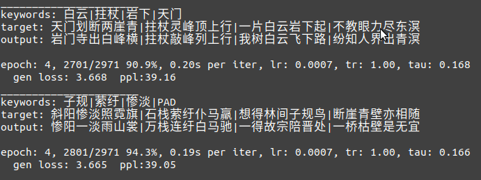
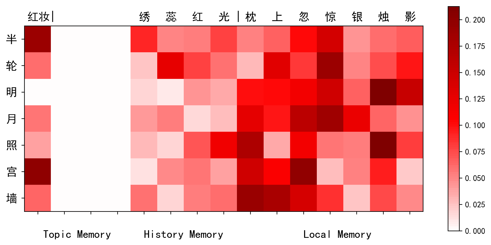

# WMPoetry
The source code of [*Chinese Poetry Generation with a Working Memory Model*](https://www.ijcai.org/Proceedings/2018/0633.pdf) (IJCAI 2018).

## 1. Rights
All rights reserved.

## 2. Requirements
* python>=3.7.0
* pytorch>=1.3.1
* matplotlib>=2.2.3 

A Tensorflow version of our model is available [here](https://github.com/XiaoyuanYi/WMPoetry).

## 3. Data Preparation
To train the model and generate poems, please 

* add the training, validation and testing sets of our [THU-CCPC](https://github.com/THUNLP-AIPoet/Datasets/tree/master/CCPC) data into the *WMPoetry/preprocess/*  directory;
* add the pingsheng.txt, zesheng.txt, pingshui.txt and pingshui_amb.pkl files of our [THU-CRRD](https://github.com/THUNLP-AIPoet/Datasets/tree/master/CRRD) set into the *WMPoetry/data/*  directory.

## 4. Preprocessing
In WMPoetry/preprocess/, just run:
```
python preprocess.py
```

Then, move the produced vocab.pickle, ivocab.pickle, train_data.pickle and valid_data.pickle into *WMPoetry/corpus/*; and move test_inps.txt, test_trgs.txt and training_lines.txt into *WMPoetry/data/*.

## 5. Training
In WMPoetry/codes/, run:
```
python train.py
```
The encoder and decoder will be pre-trained as a denoising seq2seq model, and then the Working Memory model is trained based on the pre-trained one.

One can also edit WMPoetry/codes/**config.py**  to modify the configuration, such as the hidden size, embedding size, data path, training epoch, learning rate and so on.

During the training process, some training information is outputed, such as:

<div align=center></div>

The training and validation information is saved in the log directory, e.g., WMPoetry/log/.

## 6. Generation
To generate a poem in an interactive interface, in WMPoetry/codes/, run:
```
python generate.py -v 1
```
Then one can input some keywords, select the genre pattern and the rhyme category, and then get the generated pome:

<div align=center>


</div>

We provide a genere pattern file for Chinese classical quatrains, please refer to WMPoetry/data/GenrePatterns.txt for details.

By running:
```
python generate.py -v 1 -s 1
```
, one can manually select each generated line from the beam candidates.

<div align=center>

</div>

By running:
```
python generate.py -v 1 -d 1
```
, one can get the visualization of memory reading probabilities and the contents stored in the memory for each generation step, such as:

<div align=center>

</div>

These visualization pictures are saved in the log directory. *NOTE*: We use simhei font  in matplotlib for Chinese characters. Therefore, to use our provided visualization script,  please make sure you have correctly  installed and set your font.


To generate poems with an input testing file, which contains a set of keywords and genre patterns, run:
```
python generate.py -m file  -i ../data/test_inps.txt -o test_outs.txt
```

## 7. Cite
If you use our source code, please kindly cite this paper:

Xiaoyuan Yi, Maosong Sun, Ruoyu Li and Zonghan Yang. Chinese Poetry Generation with a Working Memory Model. *In Proceedings of the Twenty-Seventh International Joint Conference on Artificial Intelligence*, pages 4553–4559, Stockholm, Sweden, 2018.

The bib format is as follows:
```
@inproceedings{Yimemory:18,
    author  = {Xiaoyuan Yi and Maosong Sun and Ruoyu Li and Zonghan Yang},
    title   = {Chinese Poetry Generation with a Working Memory Mode},
    year    = "2018",
    pages   = "4553--4559",
    booktitle = {Proceedings of the Twenty-Seventh International Joint Conference on Artificial Intelligence},
    address = {Stockholm, Sweden}
}
```
## 8. System
This work is a part of the automatic Chinese poetry generation system, [THUAIPoet (Jiuge, 九歌)](https://jiuge.thunlp.cn) developed by Research Center for Natural Language Processing, Computational Humanities and Social Sciences, Tsinghua University (清华大学人工智能研究院, 自然语言处理与社会人文计算研究中心). Please refer to [THUNLP](https://github.com/thunlp) and [THUNLP Lab](http://nlp.csai.tsinghua.edu.cn/site2/) for more information.

<div align=center></div>

## 9. Contact
If you have any questions, suggestions or bug reports, please feel free to email yi-xy16@mails.tsinghua.edu.cn or mtmoonyi@gmail.com.
